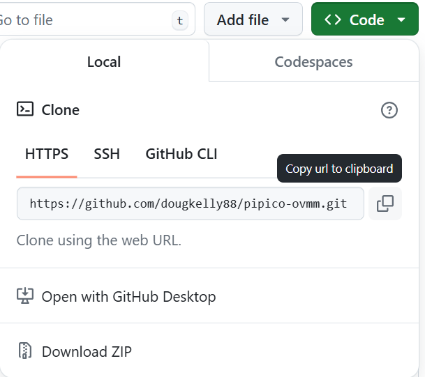

# July 2024 work experience tutorials

On [Project AOC](https://www.microsoft.com/en-us/research/project/aim/) we are exploring using an analog-optical computer as alternative hardware to GPUs to accelerate machine learning inference and solving difficult optimisation problems. 

A key part of this machine is the *optical vector-matrix multiplier* (OVMM): here, we will use a Raspberry Pi Pico microcontroller and some simple, cheap electronics to build an example OVMM machine. 

## Getting started
Raspberry Pi Pico doesn't play well with Codespaces 😭 so:
* Get Python 3.11 from [here](https://apps.microsoft.com/detail/9nrwmjp3717k?hl=en-us&gl=GB)
* Download and install Git from [here](https://git-scm.com/download/win)
* Download and install VSCode from [here](https://code.visualstudio.com/Download)
* Open VS Code
* Clone the repo from the remote on [Github](https://github.com/dougkelly88/pipico-ovmm):
    
    * In the github browser window, hit the green "Code" button:

    

    * Copy the URL
    * In VS Code, hit `Ctrl+Shift+P` and start typing `Git: Clone`
    * Paste the URL in the box that pops up and hit enter
    * Choose a location on your computer to save the repo
    * 

### If Python install doesn't work...
Try this instead:
* Start a powershell terminal in VS Code then type: 
* `cd $env:USERPROFILE` 
* `git clone https://github.com/pyenv-win/pyenv-win.git "$env:USERPROFILE\.pyenv"`
* `[System.Environment]::SetEnvironmentVariable('PYENV',$env:USERPROFILE + "\.pyenv\pyenv-win\","User")`
* `[System.Environment]::SetEnvironmentVariable('path', $env:USERPROFILE + "\.pyenv\pyenv-win\bin;" + $env:USERPROFILE + "\.pyenv\pyenv-win\shims;" + [System.Environment]::GetEnvironmentVariable('path', "User"),"User")`

Close the PowerShell terminal and open a new one (again PowerShell).

* `pyenv update`
* `pyenv install 3.11.5`
* `pyenv global 3.11.5`
* `pyenv rehash`

